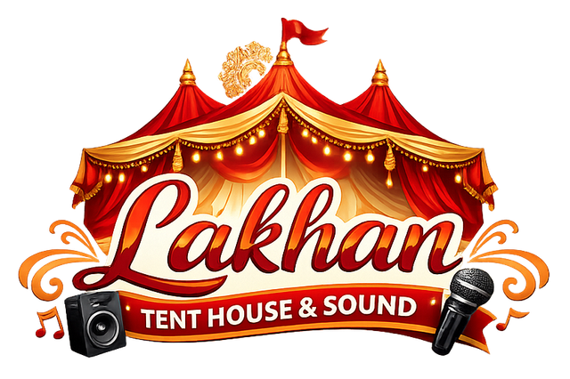

<div align="center">
  
  <h1>🎪 Lakhan Tent House & Sound</h1>
  <p><strong>Premium Event Decoration & Sound Services in Hazaribagh</strong></p>

  <p>
    <a href="#features"></a>
    <a href="#tech-stack"></a>
    <a href="#getting-started"></a>
    <a href="#contact-us"></a>
  </p>
</div>

---

## 🌟 Overview

**Lakhan Tent House & Sound** is a visually stunning, bilingual static web application built to showcase premium tent decoration, high-quality DJ sound, grand stage lighting, and professional catering services. It features a fully responsive design, a dynamic language toggle (Hindi/English), and a "Become a Verified Customer" portal with local storage tracking.

## ✨ Features

- **🌐 Bilingual Support:** Seamlessly switch between English and Hindi using a custom-built translation engine.
- **📱 Fully Responsive:** Carefully crafted layouts that look perfect on desktops, tablets, and mobile devices.
- **🎨 Premium UI/UX:** Features a luxurious color palette (maroon and gold), smooth CSS animations, glassmorphism effects, and premium font pairings.
- **✅ Verified Customer Portal:** A gamified tracker that simulates event bookings and grants verified customer status using `localStorage`.
- **✍️ Authentic Signatures:** Elegant, generated cursive signatures blended perfectly into the design using CSS `mix-blend-mode`.
- **📸 Dynamic Gallery:** A beautiful grid gallery showcasing previous premium events and decorations.

## 🛠️ Tech Stack

This project is built using modern, lightweight vanilla web technologies:

- **HTML5:** Semantic HTML structure for maximum accessibility and SEO.
- **CSS3:** Custom CSS variables for theming, CSS Grid & Flexbox for layout, media queries for responsiveness, and keyframe animations.
- **JavaScript (ES6):** Vanilla JS for DOM manipulation, translation logic, and local state management.
- **Bootstrap Icons:** Lightweight SVG icons integrated via CDN.
- **Google Fonts:** Utilizing 'Marcellus' for elegant headings, 'Poppins' for clean body text, and customized cursive fonts for signatures.

## 🚀 Getting Started

Since this is a fully static website with no backend dependencies, getting started is extremely simple:

1. **Clone the repository**
   ```bash
   git clone https://github.com/Manav1918/Lakhan_Tent_House.git
   ```

2. **Open the project**
   Simply navigate to the project directory and open `index.html` in any modern web browser.
   ```bash
   cd Lakhan_Tent_House
   # Double-click index.html or open it via terminal
   ```

3. **Optional (Live Server)**
   For the best development experience, run it using a local server like VS Code's Live Server extension.

## 📍 Contact Us

**Lakhan Tent House & Sound**
Dumari, Near Pani Tanki, Chandwara-Bachhai Road, Singhrawan, 
Hazaribagh, Jharkhand - 825406

📞 **Phone:** +91 99311 06136, +91 62017 21220

---

<div align="center">
  <sub>Built with ❤️ by CID</sub>
</div>
